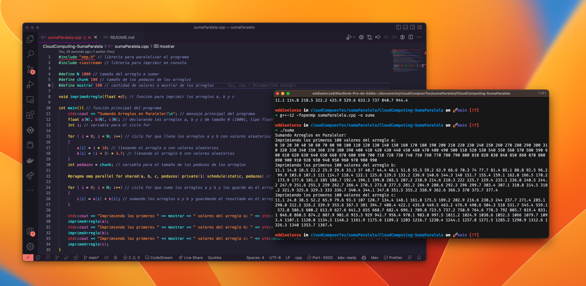

# Tarea 1. Programación de una solución paralela - Cloud Computing
----
**EDDIE G. ELORZA RUIZ | A01793547**

>Materia: Cómputo en la nube (Gpo 10)

>Profesor Titular: Eduardo Antonio Cendejas Castro


## Build with gcc 12.0.0 

* Instalar gcc 12.0.0
```bash
   brew install gcc@12
   brew cleanup 
```
* instalar libomp
```bash
   brew install libomp
```

* Compilar y ejecutar
```bash
   g++-12 -fopenmp sumaParalela.cpp -o suma
   ./suma
```

## Evidecia de ejecución

    
